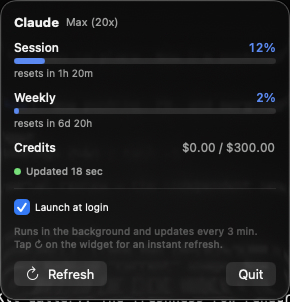

# Claude Usage Widget

A native macOS **Notification Center / desktop widget** that shows your Claude usage the same way
the claude.ai and Claude Code `/usage` panel does — session limit, weekly limit, per-model weekly
limits (Opus, Fable, …), and usage credits — for **any plan** (Pro, Max 5×, Max 20×, credit/overage).

<p align="center">
  
  &nbsp;&nbsp;
  
</p>

<p align="center">
  
  
  
</p>

> **Unofficial.** This reads an *undocumented* Anthropic endpoint and is **not affiliated with or
> endorsed by Anthropic**. It may break at any time. See [security & disclaimer](#security).

## ⚡ Install with Claude Code (easiest)

Clone the repo, open **Claude Code** in the repo folder, and paste this prompt — it will read the
docs, check what you're missing, install what it can, guide the manual bits, and set up the widget:

```text
Install this macOS "Claude Usage" widget for me from this repo.
1. Read README.md and SECURITY.md, then tell me in 2 lines what the app does with my Claude token.
2. Check my prerequisites: macOS; Xcode.app installed; Homebrew; that I'm signed into Claude Code
   (run `claude`); and signed into Xcode with an Apple ID (Settings > Accounts) for a free Personal Team.
3. Install anything missing that is safe to install non-interactively (e.g. `brew install xcodegen`).
   If Xcode.app or the Xcode Apple-ID sign-in is missing, walk me through those (they are manual).
4. Run `./scripts/install.sh` and show me any errors, fixing what you can.
5. When it builds, tell me to click "Always Allow" on the Keychain prompt, then walk me through
   adding the "Claude Usage" widget in Notification Center (Launch at login turns on automatically).
Explain each step briefly before running it, and never print my token.
```

Prefer to drive it yourself? Jump to [Manual install](#manual-install).

## Features

- **Session** (5-hour), **Weekly** (all-models), and per-model **Weekly · <model>** limits (Opus,
  Fable, …) — utilization % with live "resets in …" countdowns. Model-scoped rows appear for
  whatever caps the API reports for your account, so new models show up on their own.
- **Usage credits** — spent vs. monthly cap (and balance) when enabled.
- **All plan types** — sections that don't apply to your plan are hidden automatically.
- Color-coded by severity (blue → amber → red), matching the claude.ai panel.
- **Tap-to-refresh (↻) on the widget**, plus a live **"Updated … ago"** freshness dot — so you always
  know how current the reading is and can force an instant fetch.
- A companion **menu-bar readout** with a refresh button and *Launch at login* (auto-enabled on first run).
- Gentle on the API: auto-refreshes every 3 min, coalesces bursts to ≤1 request / 20 s, and backs off
  on rate limits.
- Runs entirely on your Mac. No server, no telemetry, token never leaves your machine except to
  Anthropic's own endpoint.

## How it works

```
Keychain (Claude Code-credentials)
        │  read token   (non-sandboxed agent only)
        ▼
ClaudeUsage.app  ──►  GET https://api.anthropic.com/api/oauth/usage
  (menu-bar agent)         │
        │  parse           ▼
        ▼            write usage.json
~/Library/Application Support/ClaudeUsage/usage.json
        ▲  read-only (sandbox path exception)
        │
ClaudeUsageWidget  (sandboxed WidgetKit extension) → renders in Notification Center
```

The agent owns auth + network because a sandboxed widget can't read Claude Code's Keychain item.
The app only reads Claude Code's token; it never refreshes, rewrites, or deletes that Keychain item.
The widget reads one plain JSON file through a read-only sandbox *path exception* — deliberately
**not** an App Group, which on macOS needs a paid developer account. A path exception is honored by
**free personal-team** signing, so no paid membership is required.

## Requirements

- macOS 14+ (built and tested on macOS 26)
- [Claude Code](https://claude.com/claude-code) signed in (this app reuses its Keychain token)
- **Xcode** (to build the WidgetKit extension) and [XcodeGen](https://github.com/yonaskolb/XcodeGen)
  (`brew install xcodegen`)
- A free Apple ID (Personal Team) for local signing — no paid membership needed

## Manual install

Prerequisites: **Xcode.app**, `brew install xcodegen`, and a one-time Xcode sign-in (Settings ▸
Accounts) for a free Personal Team. Then, from the repo root:

```bash
./scripts/install.sh        # auto-detects your Team ID, configures, builds, installs, launches
#   make install            # same thing
#   ./scripts/install.sh <TEAM_ID>   # if auto-detect can't find your team
```

Then: click **Always Allow** on the first-run Keychain prompt → open **Notification Center** →
**Edit Widgets** → add **Claude Usage** (medium). **Launch at login is enabled automatically** on
first run (toggle it from the menu-bar gauge icon), so the agent keeps the widget fresh after a reboot.

<details>
<summary>Prefer to run the steps yourself</summary>

```bash
brew install xcodegen
./scripts/configure.sh <TEAM_ID>   # generates entitlements + the Xcode project
#   Team ID: security find-certificate -c "Apple Development" -p | openssl x509 -noout -subject
open ClaudeUsage.xcodeproj         # ⌘R  (or: make build)
```
</details>

### Verify the data layer without Xcode

```bash
make check        # or: swift run DataLayerCheck   → "ALL CHECKS PASSED"
make live         # or: swift run DataLayerCheck --live   (Keychain → endpoint → parsed snapshot)
bash scripts/fetch_usage.sh        # the same request in shell form
```

## Repo layout

| Path | What |
|------|------|
| `Shared/` | Model, parser, formatting, Keychain + fetch, snapshot store (pure, testable) |
| `SharedUI/` | SwiftUI pieces shared by the menu bar popover and the widget |
| `ClaudeUsageApp/` | The background agent app (menu bar item, timer, login item) |
| `ClaudeUsageWidget/` | The WidgetKit extension (TimelineProvider + small/medium views) |
| `Tools/DataLayerCheck/` | Data-layer assertions that run with **no Xcode** |
| `fixtures/` | Sample API responses for Pro / Max 5× / Max 20× / limits-only |
| `scripts/install.sh` | One-command install (auto-detects Team ID, builds, installs, launches) |
| `scripts/configure.sh` | Generates local entitlements + project with your Team ID |
| `scripts/fetch_usage.sh` | The live request in shell form (handy for debugging) |
| `project.yml` | XcodeGen spec → `ClaudeUsage.xcodeproj` |

## How it runs

Two pieces:

1. **`ClaudeUsage.app` — a background menu-bar agent** (no Dock icon). It reads the token, calls the
   usage endpoint, writes `~/Library/Application Support/ClaudeUsage/usage.json`, and reloads the
   widget. It's the only piece that does any work; the widget just draws its output.
2. **The WidgetKit extension** — renders that JSON in Notification Center / on the desktop.

**Launch at login (bulletproof).** The agent must be running for the widget to stay current, so on
its **first launch it enables itself as a login item automatically** (you'll see "Claude Usage" in
System Settings ▸ General ▸ Login Items). You can toggle this any time from the menu-bar icon; if
macOS parks it as "needs approval," the menu shows a one-tap shortcut to the Login Items settings.
Keep the app in **/Applications** — `SMAppService` won't register a copy run from DerivedData or a
quarantined download.

**Verify it's running:** `pgrep -lf ClaudeUsage.app/Contents/MacOS/ClaudeUsage` (should print a PID),
or just open the menu-bar gauge — the freshness row shows a green "Updated … ago".

## How often it updates

- **Automatically every 3 minutes** (`UsageAgent.refreshInterval`) in the background.
- **On demand, instantly:** open the menu-bar popover, or tap **↻** on the widget (which signals the
  agent to fetch right then).
- All triggers are **coalesced to ≤1 request per 20 s** and a **429 backs off** (honoring
  `Retry-After`), so the app never trips Anthropic's rate limits. The "Updated … ago" label always
  shows the true age; WidgetKit repaints the widget on its own budget between fetches.
- **Token handling is read-only.** The token lasts ~8 h and Claude Code refreshes it during normal
  use. If it expires while Claude Code is idle, the widget shows the last snapshot as **stale** until
  Claude Code refreshes its own credential — this app never writes to the Keychain.

## Security

The token is read from the Keychain, sent only to Anthropic's `/api/oauth/usage`, and **never
written to disk or logged** — only the derived usage numbers are stored. Full details, sandboxing,
and the unofficial-endpoint disclaimer are in **[SECURITY.md](SECURITY.md)**.

## Roadmap

- `systemSmall` polish and optional multi-account support.
- A signed, notarized release build so friends can install without Xcode.

## License

[MIT](LICENSE) © 2026 Andres Milioto. Not affiliated with Anthropic.
